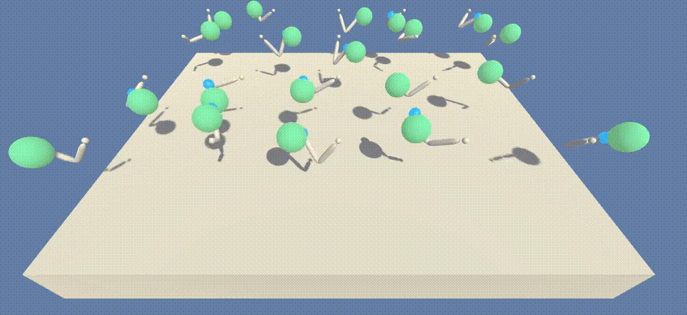

# The Reacher environment solved using Policy Gradient Algos

A deep reinforcement learning agent collecting bananas.

This is a Python implementation of deep q-network based reinforcement learning agent 
learning to collect yellow bananas and avoid blue bananas in a simulated 3D environment. 


# Description of the environment

The task at hand consists of navigating a flat 3D environment (pictured above) with the goal of
collecting (stepping over) yellow bananas while avoiding blue bananas.  

We train a reinforcement learning agent to solve this task. The agent observers
the environment though a 37-dimensional real vector (state space), consisting of the agents' 
current velocity, along with ray-based perception of objects around agent's forward direction.

The time is divided into turns. An episode ends after 300 turns. At each turn, 
the agent chooses one of the following actions:

    0 - move forward.
    1 - move backward.
    2 - turn left.
    3 - turn right.

The chosen action is executed by the environment and the agent receives a numerical reward. 
Walking over a yellow banana produces a reward of +1 and walking over a blue
banana results in a negative reward of -1. The goal of the agent is to collect as many
yellow bananas as possible, while trying to avoid blue bananas, i.e., to maximize
the cumulative reward at the end of the episode. 

The environment is considered solved, if a trained agent 
achieves an average cumulative reward above 13 over 100 consecutive episodes.

# Installation instructions

The scripts in this repository require Python 3.6 and the following packages to run properly: 

* pytorch 1.0
* numpy
* pandas
* matplotlib
* requests

The installation instructions are as follows (tested on a Linux system): 

0. Clone this repository using
```commandline
git clone https://github.com/jwergieluk/deep_banana_eater.git
```

1. Install Anaconda Python distribution: https://www.anaconda.com/distribution/#download-section
2. Create a virtual environment with all the necessary packages and activate it:

```commandline
conda create -n deep_banana_eater -c pytorch python=3.6 pytorch torchvision numpy pandas matplotlib requests click
conda activate deep_banana_eater
```

3. Clone Udacity's `deep-reinforcement-learning` repository and install the necessary Python package
into the environment:
```commandline
git clone --depth 1 https://github.com/udacity/deep-reinforcement-learning.git
cd deep-reinforcement-learning/python 
pip install .
cd ../..
```

4. Download the environment files using the provided script:
```commandline
cd deep_banana_eater
python download_external_dependencies.py
cd ..
```

5. Clone and install the `ml-agents` package provided by Unity: 
```commandline
git clone --depth 1 https://github.com/Unity-Technologies/ml-agents.git
cd ml-agents/ml-agents
pip install .
cd ../../deep_banana_eater
```

All development and testing of this code was performed on an Arch Linux system in Mar 2019. 

# Usage

## Watch a trained agent

Use the following command to load a pretrained agent and watch the agent's interactions with the environment: 
```commandline
python deep_banana_eater.py test --load-weights-from dqn-weights.bin
```



## Train an agent

The `train` command of the `deep_banana_eater.py` script can be used to train an agent 
and save the learned parameters to disk: 
```commandline
python deep_banana_eater.py train --max-episodes 1800
```

The above command runs 1800 training episodes and saves the results to the `runs` directory.

# License

deep_banana_eater is released under the MIT License. See LICENSE file for details.

Copyright (c) 2019 Julian Wergieluk
