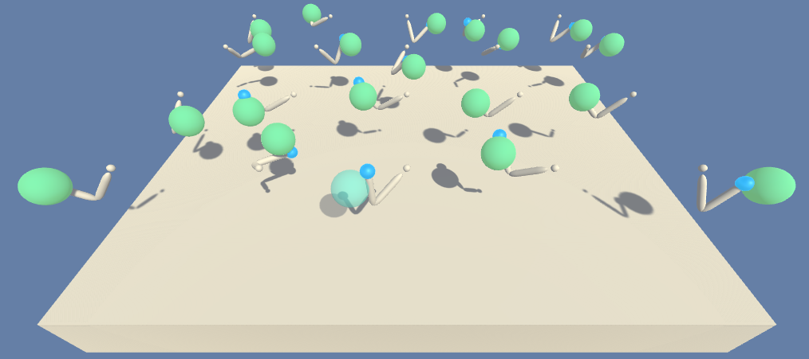

# The Reacher environment solved using the Deep Deterministic Policy Gradient (DDPG) algorithm

This is a Python implementation of a policy gradient based reinforcement learning agent 
learning to solve the "Reacher" environment from Unity's ML-agents collection.
This project was done as part of the Udacity Deep Reinforcement Learning Nanodegree. 



# Description of the environment

The task tackled in this project consists of solving a control problem for a robotic
arm with two joints. The goal is to steer the arm such that its tip touches a moving
ball for as long as possible.

We train a reinforcement learning agent to solve this task. The agent observers
the environment through a 33-dimensional real vector (state space), consisting of
position, rotation, velocity, and angular velocities of the arm, and position information of the ball.

The time is divided into turns. An episode ends after 1000 turns. In each turn, 
the agent chooses an action form the four-dimensional continuous space `[-1, 1]^4`.
The chosen action is executed by the environment and the agent receives a numerical reward.
Each time the tip of the arm touches the ball, the agent receives the reward of +0.1.
The goal is to touch the ball for as long as possible which corresponds to
maximizing the cumulative reward.  

We train a DDPG agent in an environment containing 20 independent copies of the problem. The environment 
is considered solved, if the average reward generated by moving all 20 arms, averaged over 100 consecutive 
episodes reaches a level above +30.

# Installation instructions

The scripts in this repository require Python 3.6 and the following packages to run properly: 

* pytorch
* numpy
* matplotlib
* requests

The installation instructions are as follows (tested on a Linux system): 

0. Clone this repository using
```commandline
git clone https://github.com/jwergieluk/drl_policy_gradients.git
```
1. Install Anaconda Python distribution: https://www.anaconda.com/distribution/#download-section
2. Create a virtual environment with all the necessary packages and activate it:
```commandline
conda create -n drl_policy_gradients -c python=3.6 pytorch torchvision numpy pandas matplotlib requests click
conda activate drl_policy_gradients
```
3. Clone Udacity's `deep-reinforcement-learning` repository and install the necessary Python package
into the environment:
```commandline
git clone --depth 1 https://github.com/udacity/deep-reinforcement-learning.git
cd deep-reinforcement-learning/python 
pip install .
cd ../..
```
4. Download the environment files using the provided script:
```commandline
cd drl_policy_gradients
python download_external_dependencies.py
cd ..
```
5. Clone and install the `ml-agents` package provided by Unity: 
```commandline
git clone --depth 1 https://github.com/Unity-Technologies/ml-agents.git
cd ml-agents/ml-agents
pip install .
cd ../../drl_policy_gradients
```

All development and testing of this code was performed on an Arch Linux system in April and Mai 2019. 

# Usage

## Watch a trained agent

Use the following command to load a pretrained agent parameters  and watch the agent's interactions with the environment: 
```commandline
python drl_policy_gradients.py test --actor-weights-file checkpoint-actor.pth --critic-weights-file checkpoint_critic.pth
```


## Train an agent

The `train` command of the `drl_policy_gradients.py` script can be used to train an agent 
and save the learned parameters to disk: 
```commandline
python drl_policy_gradients.py train --max-episodes 250
```

The above command runs for 250 training episodes and saves the resulting parameters of a trained agent to the current directory.

# License

drl_policy_gradients is released under the MIT License. See LICENSE file for details.

Copyright (c) 2019 Julian Wergieluk
